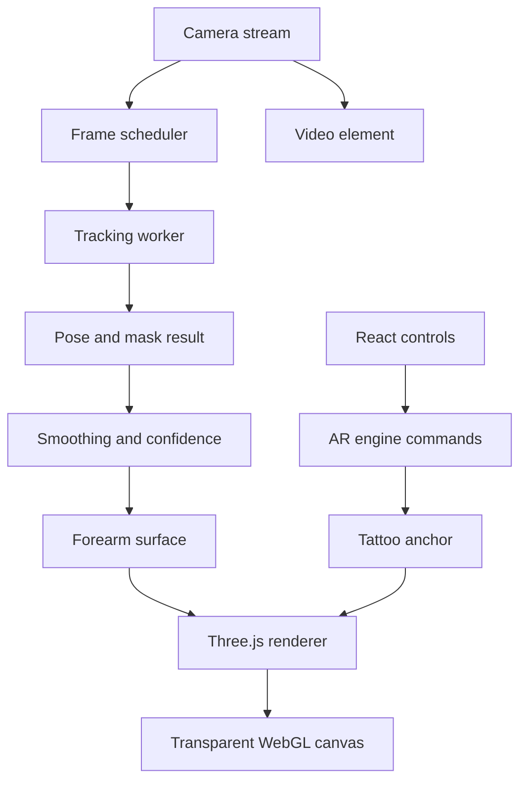
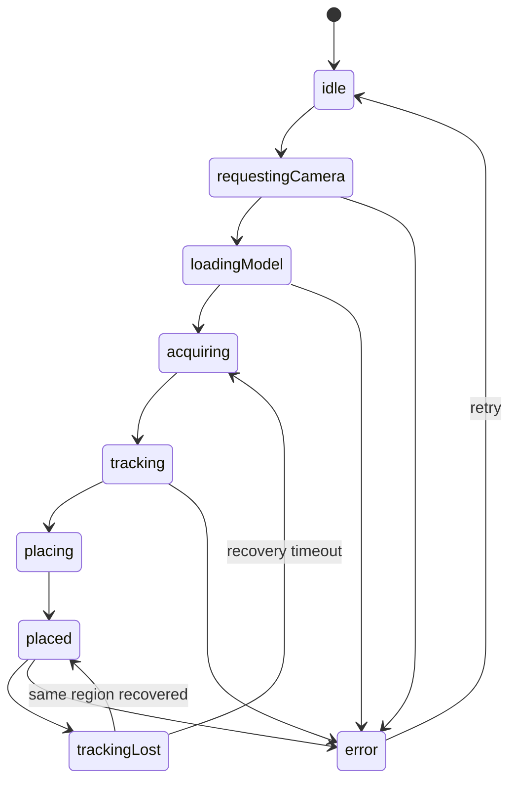

# ADR-0001: Browser architecture for live AR tattoo try-on

- **Status:** Proposed
- **Date:** 2026-08-30
- **Scope:** Greenfield proof of concept and MVP
- **First supported region:** One forearm at a time
- **Primary reader:** Codex and project contributors

## 1. Decision summary

Build the first version as a client-side, markerless AR web application. Use MediaPipe Pose Landmarker for body tracking, a custom parametric forearm surface, and Three.js/WebGL for rendering the tattoo as a texture on that surface.

React is the application/control layer only. The camera, tracking loop, geometry updates, smoothing, and rendering live in a framework-independent `ar-engine` package and must not write per-frame data into React state.

The proof of concept supports only one forearm and must prove three things before the product expands to other body regions:

1. The tattoo remains anchored to the same point on the forearm while the person moves.
2. The tattoo curves and changes perspective plausibly when the forearm rotates.
3. The result stays visually stable and interactive on a representative mobile device.

The future 3D body scan and rotatable avatar are explicitly deferred. The surface-coordinate model introduced here must make that future feature possible without changing the saved tattoo-placement contract.

## 2. Context

The product lets a user upload a tattoo sketch and preview it on their body through a live camera. A placed tattoo must not be stored in screen pixels. It must remain attached to a body region and deform when that region moves or rotates.

A flat image attached to two pose landmarks is insufficient: it can translate and rotate in screen space, but it cannot wrap around a limb, disappear around its far side, or preserve a meaningful location when the camera perspective changes.

A complete personalized human reconstruction such as an SMPL/SMPL-X pipeline is also inappropriate for the first version. It introduces a large ML, performance, licensing, and possibly backend/GPU scope before the core product hypothesis is validated.

## 3. Goals

The PoC/MVP must:

- run in a mobile browser using a normal camera stream;
- keep all camera frames and uploaded sketches on the device;
- let the user upload a transparent PNG or an opaque PNG/JPEG sketch;
- let the user place, scale, and rotate the sketch on one forearm;
- store placement in body-surface coordinates, not viewport coordinates;
- update the surface and tattoo as the arm moves;
- handle temporary tracking loss without the tattoo jumping to a new location;
- expose performance and tracking diagnostics in development mode;
- keep the AR engine independent from React and from a particular tracker implementation.

## 4. Non-goals for the first MVP

Do not implement any of the following until the forearm feasibility gates pass:

- full-body or multi-region support;
- back, chest, ribs, shoulders, thighs, or calves;
- personalized 3D body reconstruction;
- a rotatable saved avatar or body scan;
- SMPL, SMPL-X, DensePose, NeRF, Gaussian splatting, or server-side ML;
- physically exact skin deformation;
- multi-person tracking;
- multiple simultaneous tattoos;
- accounts, cloud persistence, a gallery, social sharing, or a backend;
- WebXR as the core platform;
- automatic removal of complex photographic backgrounds;
- a production tattoo recommendation or body-measurement system.

The target is a convincing visual try-on, not a medical or millimetre-accurate preview.

## 5. Architectural decision

### 5.1 Technology choices

| Concern            | Decision                                                | Notes                                                                                |
| ------------------ | ------------------------------------------------------- | ------------------------------------------------------------------------------------ |
| UI                 | React + TypeScript                                      | Controls and coarse application state only                                           |
| Build              | Vite                                                    | Keep the PoC simple; pin exact dependency versions in the lockfile                   |
| Pose and mask      | `@mediapipe/tasks-vision` Pose Landmarker               | Outputs normalized landmarks, world landmarks, visibility, and optional segmentation |
| Rendering          | Three.js with `WebGLRenderer`                           | Use a custom `BufferGeometry`; do not use `DecalGeometry` for the limb surface       |
| Tracking execution | Dedicated Worker when supported                         | `detectForVideo()` is synchronous; keep it off the UI thread                         |
| Frame scheduling   | `requestVideoFrameCallback`, with a documented fallback | Submit only the newest available frame to tracking                                   |
| Smoothing          | One Euro Filter                                         | Separate filters for position, radius, and axial orientation                         |
| Tests              | Vitest + Playwright                                     | Pure math tests, adapter tests, and browser smoke tests                              |
| Persistence        | In memory for MVP                                       | Optional IndexedDB session restore is a later feature                                |

Do not hardcode major-version-specific APIs in this ADR. At project bootstrap, install current compatible releases, commit the lockfile, and record the selected versions in the README.

### 5.2 Runtime topology



The `<video>` and transparent WebGL canvas are initially stacked in the DOM. Both must use the same explicit cover/contain transform from source pixels to display pixels. Do not independently approximate their sizing with unrelated CSS rules.

Rendering the camera as a `VideoTexture` is deferred. It is useful for compositing/export, but the extra texture path is not required to validate anchoring.

### 5.3 Process boundaries

The main thread owns:

- React and user input;
- the `<video>` element;
- Three.js scene and render loop;
- the latest smoothed tracking state;
- tattoo asset, placement, and debug UI.

The tracking worker owns:

- loading and disposing the MediaPipe task;
- synchronous pose inference;
- extracting the minimal result needed by the main thread;
- reducing/cropping mask data before transfer, where practical;
- rejecting stale or non-monotonic frames.

Only one inference may be in flight. When tracking is busy, replace the queued frame with the newest frame and close/dispose the discarded `ImageBitmap` or `VideoFrame`. Never build an unbounded frame queue.

Provide a throttled main-thread tracker adapter as a compatibility fallback. The engine depends on a `PoseTracker` port and must not know which adapter is active.

## 6. Coordinate systems

Coordinate-space confusion is the highest-probability implementation bug. Create one `ViewportTransform` module and prohibit ad hoc mirroring or scale calculations elsewhere.

The application uses these spaces:

1. **Source pixels:** camera's intrinsic video width and height.
2. **Tracker normalized image:** unmirrored `x/y` in the model input.
3. **Tracker world:** MediaPipe-relative `x/y/z`; useful for pose proportions but not a calibrated world reconstruction.
4. **Display pixels:** coordinates after crop/letterbox, device rotation, and optional selfie mirroring.
5. **Renderer/NDC:** Three.js coordinates used for ray casting and drawing.
6. **Body-local surface:** stable forearm coordinates `(u, v)`.

Rules:

- Feed a consistently oriented, unmirrored frame to the tracker.
- Mirror only the display transform for a front-facing camera.
- Pointer events are converted from display pixels back through the inverse display transform before hit testing.
- Camera rotation and CSS `object-fit` are part of the transform, not special cases in components.
- Unit-test round trips: source → display → source and display → NDC → display.

## 7. Domain contracts

These are logical contracts. Codex may add implementation details but must preserve their boundaries.

```ts
export type BodySide = 'left' | 'right';

export type BodyRegion = 'leftForearm' | 'rightForearm';

export interface Vec2 {
  x: number;
  y: number;
}

export interface Vec3 {
  x: number;
  y: number;
  z: number;
}

export interface PosePoint {
  image: Vec3;
  world: Vec3;
  visibility: number;
}

export interface PoseFrame {
  frameId: number;
  timestampMs: number;
  landmarks: ReadonlyArray<PosePoint>;
  mask?: SegmentationFrame;
  inferenceMs: number;
}

export interface PoseTracker {
  initialize(config: TrackerConfig): Promise<void>;
  submit(frame: ImageBitmap, timestampMs: number): void;
  subscribe(listener: (frame: PoseFrame) => void): () => void;
  dispose(): Promise<void>;
}

export interface TattooAnchor {
  schemaVersion: 1;
  region: BodyRegion;
  /** 0 at wrist, 1 at elbow. */
  u: number;
  /** Angular coordinate around the modeled surface, normalized to [0, 1). */
  v: number;
  /** Size relative to forearm length, not viewport pixels. */
  width: number;
  height: number;
  /** Rotation in the tangent plane, radians. */
  rotation: number;
}

export interface BodySurface {
  readonly region: BodyRegion;
  update(frame: SmoothedPoseFrame): SurfaceUpdate;
  hitTest(ray: Ray): SurfaceHit | null;
  uvToWorld(uv: Vec2): SurfacePoint;
  getGeometry(): THREE.BufferGeometry;
  getConfidence(): number;
}

export interface AREngine {
  initialize(input: EngineInput): Promise<void>;
  start(): void;
  pause(): void;
  setTattoo(asset: TattooAsset | null): void;
  setAnchor(anchor: TattooAnchor | null): void;
  getSnapshot(): EngineSnapshot;
  subscribe(listener: (event: EngineEvent) => void): () => void;
  dispose(): Promise<void>;
}
```

Per-frame pose and mesh data are mutable engine internals. `EngineSnapshot` contains only low-frequency UI state such as readiness, error, selected region, tracking quality, and whether placement is possible.

## 8. Forearm surface model

### 8.1 Geometry

Model the forearm as a tapered elliptical cylinder sampled into a grid:

- longitudinal segments: start with 12;
- radial segments: start with 24;
- centerline: wrist to elbow;
- wrist and elbow radii: estimated from the segmentation silhouette, with conservative anatomical fallbacks;
- cross-section: ellipse, not a perfect circle;
- seam: place on the least visible side and keep it stable between frames.

`u` is the normalized position from wrist to elbow. `v` is the normalized angle around the cross-section. The tattoo uses a sub-range of this UV surface rather than a screen-space quad.

### 8.2 Local orientation

The forearm axis is derived from wrist and elbow. Axial roll around that axis is not directly observable from only wrist, elbow, and shoulder. Estimating it is a feasibility risk, not a solved assumption.

Use this evidence in priority order:

1. wrist/index/pinky/thumb pose points when visible;
2. the forearm silhouette and its temporal change;
3. the previous stable local frame transported to the new axis;
4. a neutral screen-facing fallback during initial acquisition.

Prevent local-frame sign flips by selecting the candidate orientation closest to the previous valid quaternion. Freeze roll briefly instead of snapping when confidence drops.

### 8.3 Radius estimation

Estimate visible limb width by sampling the segmentation mask along lines perpendicular to the projected centerline at several `u` positions. Reject samples that intersect another large body region or leave the frame.

Mask and radius estimation may run less frequently than pose tracking. Smooth radii more aggressively than joint positions because perceived limb thickness should not pulse from frame to frame.

### 8.4 Tracking confidence

Surface confidence combines:

- wrist and elbow visibility;
- supporting hand-point visibility;
- projected limb length;
- percentage of the region inside the frame;
- valid segmentation samples;
- age of the most recent tracking result.

Use hysteresis:

- enter `tracking` only after several consecutive good frames;
- enter `lost` only after several consecutive bad frames;
- keep the last valid surface briefly while fading the tattoo;
- never silently re-anchor to another arm.

## 9. Tattoo placement and rendering

### 9.1 Asset pipeline

The asset loader must:

- accept PNG and JPEG;
- apply image orientation correctly;
- downscale large inputs to a configured maximum texture size;
- preserve source alpha;
- generate a disposable Three.js texture;
- revoke object URLs and dispose replaced GPU textures.

PoC fixtures may require transparent PNG. Before calling the result an MVP, add a basic white-paper removal control for opaque sketches: threshold, feather, and invert. Complex background removal remains out of scope.

### 9.2 Placement

On pointer down:

1. convert display coordinates through `ViewportTransform`;
2. raycast against the current forearm mesh;
3. obtain the hit UV;
4. create or update `TattooAnchor`;
5. preserve the anchor in body-local coordinates for subsequent frames.

Drag changes `(u, v)`. Pinch changes normalized width/height. Rotation changes the tangent-plane angle. Clamp placement to the supported surface and show visible feedback when the design crosses the UV seam or region boundary.

### 9.3 Mesh and shader

Use a tattoo patch mesh derived from the forearm surface or sample the forearm surface directly in a custom geometry. Do not fake curvature by applying a CSS transform to the image.

Initial fragment behavior:

- alpha-test transparent pixels;
- multiply or darken skin using tattoo luminance and user-controlled opacity;
- add a small configurable edge feather;
- apply polygon offset or a normal offset to avoid z-fighting;
- cull or fade fragments on the far side of the modeled forearm;
- clip drawing outside the body segmentation mask when mask confidence is adequate.

Start with a simple, measurable shader. Skin-lighting estimation, color adaptation, blur matching, and camera-noise matching are later quality passes.

## 10. Scheduling and lifecycle

Run rendering and tracking at independent rates:

- renderer: `requestAnimationFrame`, normally display refresh rate;
- frame acquisition: `requestVideoFrameCallback` when available;
- tracker: adaptive target of 15–30 results per second;
- segmentation/radius update: may run at 5–15 results per second;
- interpolation: render between the two latest accepted smoothed poses.

Never send every camera frame blindly to ML. Adapt tracking cadence using recent inference time and device load.

Required lifecycle behavior:

- pause tracking and rendering when the document becomes hidden;
- stop media tracks on engine disposal;
- terminate the worker and close transferred frames;
- dispose geometries, materials, textures, and the renderer;
- tolerate React Strict Mode mount/unmount/mount in development;
- ensure `initialize()` and `dispose()` are idempotent or explicitly guarded.

## 11. Application state machine



React may mirror this low-frequency state. It must not receive vertex arrays or raw landmark updates as component state.

## 12. Suggested repository structure

```text
src/
  app/
    App.tsx
    ar-session/
      ARSessionPage.tsx
      useAREngine.ts
      session-state.ts
  ar-engine/
    AREngine.ts
    contracts.ts
    camera/
      CameraController.ts
      ViewportTransform.ts
      frame-scheduler.ts
    tracking/
      PoseTracker.ts
      worker/
        pose.worker.ts
        messages.ts
      MainThreadPoseTracker.ts
      landmark-indices.ts
    filtering/
      OneEuroFilter.ts
      PoseSmoother.ts
      confidence.ts
    surfaces/
      BodySurface.ts
      forearm/
        ForearmSurface.ts
        ForearmFrame.ts
        ForearmRadiusEstimator.ts
        ForearmGeometry.ts
    tattoo/
      TattooAssetLoader.ts
      TattooAnchor.ts
      TattooPatch.ts
      tattoo-shader.ts
    rendering/
      ARRenderer.ts
      DebugRenderer.ts
    diagnostics/
      PerformanceMetrics.ts
      DebugSnapshot.ts
  test-fixtures/
    README.md
public/
  models/
docs/
  adr/
```

Keep math utilities next to the domain that owns them. Do not create a generic `utils/` dumping ground.

## 13. Implementation plan for Codex

Each phase is a separate reviewable change. Codex must run the phase's checks and report the acceptance evidence before starting the next phase.

### Phase 0 — Bootstrap and capability shell

Deliver:

- React/TypeScript/Vite application;
- strict TypeScript and lint configuration;
- camera permission flow and device selection;
- stacked video/canvas viewport;
- capability report for Worker, WebGL2, `requestVideoFrameCallback`, transferable frame type, and camera constraints;
- `ViewportTransform` with debug grid and round-trip unit tests;
- development diagnostics overlay behind a flag.

Acceptance:

- rear and selfie camera previews have correct aspect ratio;
- selfie preview is visually mirrored but tracker input remains canonical;
- tapping a debug point maps to the same source-video location after rotation/cropping;
- denied permission produces a recoverable UI state.

### Phase 1 — Pose tracking vertical slice

Deliver:

- MediaPipe model loaded from same-origin static assets;
- `PoseTracker` interface;
- Worker implementation plus throttled fallback adapter;
- latest-frame-only backpressure;
- landmark/debug skeleton overlay;
- explicit cleanup and model-load errors.

Acceptance:

- wrist, elbow, shoulder, thumb, index, and pinky points align with the preview;
- UI controls stay responsive during tracking;
- memory does not grow continuously during a three-minute session;
- switching cameras restarts the camera stream and frame scheduler cleanly while
  reusing the loaded tracker.

### Phase 2 — Smoothing, confidence, and loss recovery

Deliver:

- One Euro filters with deterministic tests;
- pose age and visibility confidence;
- `acquiring`, `tracking`, and `trackingLost` transitions with hysteresis;
- debug graphs for inference time, tracking FPS, render FPS, and confidence.

Acceptance:

- stationary landmarks no longer visibly vibrate at normal viewing size;
- fast arm movement remains acceptably responsive;
- covering or moving the forearm out of frame fades/freezes the overlay instead of snapping;
- reacquisition of the same arm restores the previous body-local anchor.

### Phase 3 — Forearm surface feasibility gate

Deliver:

- left/right forearm selection;
- stable forearm local frame;
- tapered elliptical `BufferGeometry` with debug wireframe;
- mask-based radius estimation and anatomical fallback;
- seam visualization;
- axial-roll estimator and confidence signal.

Acceptance gate:

- with the forearm visible, the wireframe follows wrist-to-elbow translation and bending;
- during at least approximately ±45° of comfortable forearm roll, orientation changes continuously without 180° flips;
- radius does not visibly pulse during a stationary five-second hold;
- losing hand landmarks causes a stable freeze/fallback, not a roll snap;
- behavior is recorded on at least one target Android device and one target iOS device, or the unsupported target is explicitly removed from MVP scope.

If axial roll is not convincing, stop. Evaluate one of these product changes before continuing:

1. require a short neutral-pose calibration;
2. restrict supported rotation and show guidance;
3. add a temporary visual marker workflow;
4. replace or supplement the tracker;
5. redefine the first region.

Do not hide the failure with stronger smoothing.

### Phase 4 — Tattoo texture and body-local anchoring

Deliver:

- transparent PNG fixture loading;
- GPU texture lifecycle;
- raycast placement;
- `TattooAnchor` creation and validation;
- drag, scale, and rotation gestures;
- curved tattoo patch and basic ink shader.

Acceptance:

- after placement, the tattoo retains its longitudinal and angular location while the arm translates and rotates;
- changing viewport size/orientation does not change the saved anchor;
- the far side of the tattoo disappears plausibly as the forearm rotates;
- replacing a texture does not leak the previous GPU resource.

### Phase 5 — User-facing upload and placement flow

Deliver:

- PNG/JPEG upload UI;
- image downscaling and orientation handling;
- simple white-background threshold/feather/invert controls;
- placement instructions and region/framing guidance;
- reset, hide, opacity, scale, and rotation controls;
- accessible non-camera error/retry UI.

Acceptance:

- a phone photo of a black sketch on white paper can produce a usable preview;
- invalid and oversized files fail safely with a useful message;
- every editing gesture works with touch and does not scroll/zoom the page accidentally;
- the user can restart without reloading the page.

### Phase 6 — Occlusion, realism, and performance

Deliver:

- body-mask clipping where reliable;
- edge feather and configurable ink blend;
- adaptive tracking cadence;
- optional resolution scaling for low-end devices;
- performance budget checks and production diagnostics opt-out.

Acceptance targets, measured rather than assumed:

- render loop: median at least 30 FPS on the selected minimum device;
- tracking: median at least 15 results/s on the selected minimum device;
- interaction remains responsive while inference runs;
- no sustained unbounded memory growth in a ten-minute session;
- visual latency and jitter pass a recorded manual review using the test motions below.

Targets may be adjusted after baseline measurement, but the change must be documented with the measured device and reason.

### Phase 7 — MVP hardening

Deliver:

- browser/device support matrix;
- Playwright smoke tests with a synthetic or prerecorded video source where the browser permits it;
- deterministic recorded pose fixtures for engine integration tests;
- privacy copy stating that images stay on device;
- graceful unsupported-browser screen;
- production build size report and model caching strategy;
- README setup, development, testing, and architecture notes.

Acceptance:

- core flow passes on every browser/device declared supported;
- camera/model errors are recoverable without a page refresh;
- engine cleanup passes repeated mount/start/stop cycles;
- no camera frame or uploaded image is sent over the network.

## 14. Test strategy

### Unit tests

Test pure code without a browser where possible:

- viewport transformations and mirroring;
- vector/quaternion math and local-frame continuity;
- One Euro Filter behavior using fixed sequences;
- confidence hysteresis;
- cylindrical UV mapping and seam normalization;
- `TattooAnchor` serialization/validation;
- frame-queue replacement and stale-result rejection.

### Integration tests

Use recorded `PoseFrame` sequences rather than running ML in every test:

- stationary hold with injected noise;
- wrist/elbow translation;
- flexion at the elbow;
- slow pronation/supination;
- temporary hand-landmark loss;
- full forearm loss and reacquisition;
- selfie-mirrored display using canonical tracker data.

Assert anchor continuity, maximum per-frame roll changes, confidence transitions, and geometry bounds.

### Manual motion script

Record short clips of:

1. five seconds stationary;
2. slow left/right translation;
3. move closer/farther from camera;
4. bend and extend the elbow;
5. rotate the forearm palm-up to palm-down;
6. briefly cover the wrist;
7. leave and re-enter the frame;
8. cross the forearm in front of the torso.

Keep representative recordings or diagnostics with the issue/PR so visual regressions are reviewable.

## 15. Performance and bundle constraints

- Lazy-load the AR route and ML model; do not put MediaPipe/Three.js in the initial non-AR shell bundle.
- Serve model and WASM assets from the same origin with immutable versioned URLs.
- Avoid copying full segmentation masks across threads every render frame.
- Reuse typed arrays and geometry buffers where safe.
- Update existing `BufferAttribute`s instead of allocating a new geometry every frame.
- Cap uploaded texture dimensions and explicitly dispose GPU resources.
- Instrument first camera frame, model ready, first pose, first stable surface, inference duration, render FPS, dropped frames, and tracking-loss count.

## 16. Privacy and security

The MVP is local-only:

- request camera access only after an explicit user action;
- do not upload, log, or persist camera frames;
- do not include user images in analytics or error reports;
- keep the tattoo image in memory unless the user explicitly asks to save a session;
- use a restrictive Content Security Policy compatible with same-origin model/WASM assets;
- validate image MIME type and decoded dimensions rather than trusting the file extension;
- document any third-party asset/model licences before release.

## 17. Risks and mitigations

| Risk                                      | Impact                                 | Mitigation / gate                                                                              |
| ----------------------------------------- | -------------------------------------- | ---------------------------------------------------------------------------------------------- |
| Forearm axial roll is underconstrained    | Tattoo appears to slide around the arm | Phase 3 hard gate; hand landmarks, silhouette, temporal frame, or product restriction          |
| Single RGB camera has no true depth       | Incorrect radius/perspective           | Treat model as plausible approximation; use world landmarks plus silhouette; communicate scope |
| Segmentation merges arm and torso         | Bad radius or occlusion                | Reject contaminated samples; use last valid radius; guide framing                              |
| ML blocks or overheats mobile device      | Poor UX                                | Worker, latest-frame backpressure, adaptive cadence, resolution scaling                        |
| Selfie mirroring changes handedness       | Wrong arm or reversed placement        | Canonical unmirrored tracking and a single display transform                                   |
| Landmark jitter becomes texture jitter    | Unconvincing result                    | One Euro filtering, confidence hysteresis, interpolate renderer state                          |
| Worker/browser differences                | Unsupported devices                    | Tracker port with fallback; explicit support matrix                                            |
| Scope expands to full-body reconstruction | MVP never validates                    | Enforce non-goals and phase gates in this ADR                                                  |
| Uploaded image looks like a sticker       | Low visual quality                     | Basic ink blend, alpha cleanup, feather; later lighting matching                               |

## 18. Consequences

### Positive

- The first experiment remains fully browser-based and privacy-friendly.
- The surface anchor survives viewport changes and can later map onto a reconstructed mesh.
- Pure engine modules and recorded pose fixtures make most behavior testable without a live camera.
- Additional body regions can be introduced as separate `BodySurface` implementations after the main risk is proven.

### Negative

- A parametric forearm is an approximation and will not match every anatomy.
- Reliable axial orientation is materially harder than position tracking.
- Worker and transferable-frame support require a compatibility path.
- High-quality occlusion is limited without depth or a fuller body model.

## 19. Deferred roadmap

Proceed only after MVP evidence exists.

### R1 — More parametric body regions

Add upper arm, calf, thigh, and a curved back patch one at a time. Each region implements `BodySurface` and receives its own feasibility/quality gate. Do not create a single generic body-region class prematurely.

### R2 — Saved try-on sessions

Store tattoo assets and versioned `TattooAnchor`s locally. Add comparison variants only after the placement model is stable.

### R3 — Back capture and rotatable 3D preview

Introduce a guided 2–5 second capture. Reconstruct or fit a static body/back mesh, then use the same logical surface anchor contract in a Three.js viewer. The first implementation may be an approximate fitted mesh; it does not need a photoreal avatar.

### R4 — Personalized body canvas

Evaluate SMPL-family or another licensed reconstruction pipeline, local versus server inference, consent/retention requirements, and GPU cost. This requires a separate ADR because it changes privacy, infrastructure, licensing, and data-lifecycle decisions.

## 20. Codex execution rules

When using this ADR as a Codex prompt/context:

1. Inspect the repository and report conflicts with this ADR before editing.
2. Implement only the requested phase; do not silently start later phases.
3. Begin each phase with a short file-level plan and end it with acceptance evidence.
4. Preserve the ports between tracker, surface, renderer, and UI.
5. Keep raw per-frame state outside React.
6. Add tests for coordinate or geometry logic in the same change that introduces it.
7. Do not add a backend, account system, WebXR, full-body model, or reconstruction dependency unless a new ADR approves it.
8. Prefer a debug visualization over guessing when coordinate math is wrong.
9. Record measured performance; do not claim performance from code inspection.
10. If Phase 3 fails, stop and present the measured failure plus options. Do not continue by weakening the acceptance criteria.
11. Update this ADR or add a superseding ADR when a material decision changes.

Suggested initial Codex instruction:

```text
Read docs/adr/0001-live-ar-tattoo-try-on.md completely.
Implement Phase 0 only. First inspect the repository and state any conflicts or
missing prerequisites. Then provide a file-level plan, implement the phase,
run its tests/checks, and report acceptance evidence. Do not begin Phase 1.
```

## 21. Official references

- MediaPipe Pose Landmarker for Web: <https://ai.google.dev/edge/mediapipe/solutions/vision/pose_landmarker/web_js>
- MediaPipe Pose Landmarker JS API: <https://ai.google.dev/edge/api/mediapipe/js/tasks-vision.poselandmarker>
- Three.js documentation: <https://threejs.org/docs/>
- Three.js `DecalGeometry` limitations, useful context for choosing custom geometry: <https://threejs.org/docs/pages/DecalGeometry.html>
- MDN `requestVideoFrameCallback`: <https://developer.mozilla.org/docs/Web/API/HTMLVideoElement/requestVideoFrameCallback>
- MDN Web Workers: <https://developer.mozilla.org/docs/Web/API/Web_Workers_API>

## 22. Decision review trigger

Review or supersede this ADR when any of these occurs:

- Phase 3 axial-roll feasibility fails;
- the product requires a region other than forearm before the MVP is complete;
- a supported browser cannot run the selected tracker architecture;
- camera frames or body data must leave the device;
- the team begins 3D capture/reconstruction work;
- measured performance cannot meet the selected minimum-device budget.
