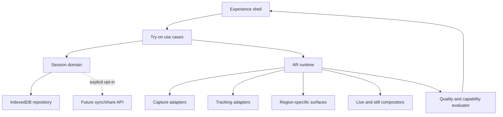

# ADR-0002 (proposed): Post-MVP product and service architecture

- **Status:** Proposed for discussion
- **Date:** 2026-09-13
- **Depends on:** ADR-0001 completed or explicitly superseded
- **Scope:** Product direction and architecture after the forearm MVP

## 1. Recommendation

After ADR-0001 is complete, evolve the proof of concept into a local-first tattoo
decision service rather than immediately adding more tracking code or a general
backend.

The next product should help a user complete one decision loop:

1. choose or import a design;
2. test placement, scale, flow, and readability on their body;
3. compare a small number of variants;
4. export a clear, honest handoff for a tattoo artist.

Keep live browser AR as the differentiator, but add guided still capture as a
quality and compatibility fallback. Preserve the on-device camera pipeline.
Introduce cloud services only for user-requested synchronization, share links,
catalogue, or artist collaboration, and only after a separate privacy and data
lifecycle ADR.

Do not begin with microservices. First extract stable product/domain boundaries
inside a modular frontend. A deployable service boundary is justified only when
there is a real remote capability or a second client.

## 2. Entry gate: what “ADR-0001 complete” means

At the branch point used for this proposal (`master` at `def7764`), Phase 2 code
is present while the README still describes the application as Phase 0. Reconcile
the README, ADR status, merged phase evidence, and device evidence before treating
the repository as an authoritative completion record.

Post-MVP work starts only when all of the following are true:

- Phases 0–7 have acceptance evidence, not only merged code.
- The Phase 3 axial-roll gate passed on the declared Android and iOS targets, or
  the supported motion/region was deliberately restricted and documented.
- A recorded motion suite covers anchoring, roll, loss, reacquisition, and camera
  switching.
- The minimum-device performance and memory budgets are measured.
- The supported-browser matrix, privacy copy, and cleanup tests exist.
- ADR-0001's final outcome is recorded as `validated`, `validated with product
restrictions`, or `failed`.

If the result is `failed`, do not proceed to more body regions. Run a short
recovery track first: neutral-pose calibration, restricted motion guidance,
optional marker assistance, tracker replacement, or a still-only product.

## 3. Comparable products and projects

Research was performed on 2026-09-13. Product pages are useful for feature and
positioning signals, but their accuracy/performance statements are vendor claims,
not independent validation.

| Product or project                                                                                                                                                                | What it demonstrates                                                                                                                                                                                                                 | Lesson for this project                                                                                                                                                   |
| --------------------------------------------------------------------------------------------------------------------------------------------------------------------------------- | ------------------------------------------------------------------------------------------------------------------------------------------------------------------------------------------------------------------------------------ | ------------------------------------------------------------------------------------------------------------------------------------------------------------------------- |
| [INKHUNTER on the App Store](https://apps.apple.com/ca/app/inkhunter-ai-tattoo-design/id991558368) and [Apple's usage story](https://apps.apple.com/pl/iphone/story/id1560989793) | Upload/gallery selection, multi-angle AR preview, and a photo editor; the documented flow uses a small drawn marker for reliable placement.                                                                                          | Marker assistance remains a valid opt-in recovery mode when markerless roll is not trustworthy. It should not be the default promise.                                     |
| [Inkjin AR try-on](https://inkjin.com/en/try-on-tattoos-ar)                                                                                                                       | Positions try-on as a fast path from design to “show this to my artist,” with library/upload, live movement, screenshots, candid limitations, artist discovery, and booking.                                                         | Compete on decision quality and honest limits, not only tracking. Comparison and artist handoff are natural next steps after placement works.                             |
| [TryItOn tattoo API](https://docs.tryiton.now/docs/api-reference/tattoo-tryon)                                                                                                    | An asynchronous still-image workflow accepts a body photo and design, then returns a rendered result.                                                                                                                                | A still mode is a distinct product capability, not a degraded live mode. A third-party/cloud implementation conflicts with local-only privacy unless explicitly approved. |
| [AR Hand Figures](https://github.com/damiansire/web-ar-hand-tracking)                                                                                                             | A browser MediaPipe/Three.js system with worker inference, one-frame backpressure, pure domain modules, and Playwright tests using a synthetic camera stream.                                                                        | ADR-0001's runtime shape is sound. Reuse its testing idea: exercise camera → worker → renderer without requiring live camera CI.                                          |
| [MindAR](https://github.com/hiukim/mind-ar-js)                                                                                                                                    | Web image/face tracking using GPU and workers, plus static-page and studio-style distribution. It does not provide a tattoo/body-surface solution and is maintained by one primary developer.                                        | Image-target tracking can inform an optional marker adapter, but replacing the body engine with MindAR would not solve curved body placement and adds dependency risk.    |
| [Banuba](https://www.banuba.com/) and its [body segmentation overview](https://www.banuba.com/technology/body-segmentation)                                                       | A commercial benchmark for on-device AR, web/white-label delivery, SDK packaging, and segmentation as a reusable capability. Its advertised try-on categories are mainly face, beauty, jewelry, and accessories rather than tattoos. | Long-term packaging can be consumer app + embeddable widget/SDK. Treat commercial claims as a benchmark to test, not evidence that tattoo tracking is solved.             |
| [Augmented Tattoo research](https://www.researchgate.net/publication/308869530_Augmented_Tattoo_Evaluation_of_an_Augmented_Reality_System_for_Tattoo_Visualization)               | A marker grid drives mesh construction; skin segmentation and marker removal improve surface-aware compositing under varied conditions.                                                                                              | Calibration/markers can buy observability and robustness. Make this a transparent fallback and measure its friction against the markerless path.                          |

### Synthesis

The comparable systems cluster into three modes:

1. **Live AR:** immediate and persuasive, but sensitive to tracking, occlusion,
   close-up framing, device heat, and underconstrained limb roll.
2. **Guided or marker-assisted AR:** more reliable registration with extra user
   preparation.
3. **Still-photo rendering:** easier to make visually polished and supports hard
   body regions, but cannot prove motion anchoring and may require cloud processing.

The redesign should support these as explicit capture strategies behind one
placement/session model. It should not pretend that one pipeline is best for every
body region and device.

## 4. Product redesign

### 4.1 Primary journey

Replace the current camera-first proof-of-concept flow with a decision-first flow:

```text
Home
  → Choose a design (sample, upload, or recent)
  → Choose body region and side
  → Capability check and mode recommendation
  → Guided capture / live AR
  → Place and tune
  → Compare up to three variants
  → Save locally or export an artist handoff
```

The app should explain what it can estimate. It can help judge placement, relative
scale, curvature, flow, and normal-distance readability. It must not claim exact
final colour, healed appearance, pain, price, or millimetre accuracy.

### 4.2 Capture modes

Expose product modes rather than implementation fallbacks:

- **Live try-on:** supported regions and motions only; fastest feedback.
- **Guided still:** user captures two or three instructed angles; compositor can
  spend more time on segmentation, shading, and edge quality.
- **Assisted live:** optional neutral-pose calibration or temporary marker when
  quality scoring predicts unreliable roll.
- **Static 3D preview:** later, for a captured/fitted body model; never imply that
  a generic avatar is the user's exact anatomy.

The capability check chooses a recommended mode using body region, browser,
device performance, tracker confidence, and requested outcome. The user can see
why another mode is recommended.

### 4.3 Session and comparison

Introduce a versioned `TryOnSession` containing:

- one source `TattooAsset` plus derived preview assets;
- capture mode and body region;
- one or more versioned surface-relative placements;
- non-image calibration metadata;
- comparable variants, each with design, placement, scale, rotation, and opacity;
- provenance and quality warnings;
- optional exported screenshots, never implicit camera-frame storage.

Start with IndexedDB and an explicit “save on this device” action. Retention,
delete, and storage usage must be visible. A later synced session keeps the same
domain contract and adds an infrastructure adapter.

### 4.4 Artist handoff

The first handoff is a local downloadable/shareable bundle, not a marketplace:

- selected design and source attribution;
- two or three user-approved preview images;
- body region and side;
- relative placement and size range;
- a warning that the artist must confirm final size and adaptation;
- no raw video, pose sequence, or segmentation mask.

Only build accounts, public links, messaging, booking, payments, or artist search
after measuring repeated export/handoff use. Those features introduce identity,
moderation, copyright, payments, retention, abuse, and support obligations that
are unrelated to AR feasibility.

## 5. Technical redesign

### 5.1 Preserve the core; change the boundaries

Keep these ADR-0001 decisions:

- browser-first and local processing;
- one `ViewportTransform` boundary;
- React for low-frequency application state only;
- framework-independent per-frame engine logic;
- body-surface coordinates for placement;
- tracker, surface, and renderer ports;
- worker inference, newest-frame backpressure, and explicit GPU/media cleanup.

Add these post-MVP boundaries:



Recommended module responsibilities:

- `try-on-domain`: versioned assets, placement, session, comparison, and export
  contracts; no DOM, React, MediaPipe, or Three.js.
- `ar-runtime`: capture scheduling, tracker orchestration, quality evaluation,
  surface updates, live rendering, and lifecycle.
- `body-surfaces`: one independently gated implementation per region. Share math,
  not assumptions about anatomy or observability.
- `compositing`: live low-latency renderer and still high-quality renderer behind
  separate ports.
- `experience`: application state machine, guidance, accessibility, commands, and
  user-visible errors.
- `infrastructure`: IndexedDB, download/share, optional telemetry, and eventually
  authenticated remote adapters.

### 5.2 Contracts to stabilize before expansion

Before adding another region, publish and test these contracts:

- `SurfacePlacementV2`: region, surface-model version, coordinates, physical or
  normalized size semantics, tangent rotation, and migration metadata.
- `CaptureStrategy`: initialize, guide, capture/submit, quality result, dispose.
- `TrackingProvider`: capabilities, normalized observations, health, dispose.
- `BodySurfaceProvider`: supported region/mode, calibrate, update, hit-test,
  placement migration, confidence.
- `Compositor`: preview, export, quality tier, resource disposal.
- `SessionRepository`: save, load, list, delete, export, storage estimate.

Do not create a universal body-surface implementation. Forearm, upper arm, calf,
thigh, torso, and back have different landmarks, deformation, visibility, and
capture requirements.

### 5.3 Repository evolution

Keep the current single application while there is one consumer. Organize stable
modules under `src/` first. Move to a workspace/monorepo only when a second
deployable client exists, such as an embeddable widget or artist portal.

A later workspace could be:

```text
apps/
  consumer-web/
  demo-lab/
packages/
  try-on-domain/
  ar-runtime/
  body-surfaces/
  try-on-ui/
  test-fixtures/
services/                 # only after a cloud ADR
  session-api/
```

This is a trigger-based target, not an immediate refactor task.

### 5.4 Optional remote boundary

If cloud features are approved, the browser remains the processor of camera data.
The API receives only the minimum user-approved artifacts needed for a use case:

- account and consent records;
- encrypted/signed session metadata;
- tattoo assets the user explicitly chose to sync;
- final preview exports selected for sharing;
- catalogue/artist metadata.

Raw frames, video, pose streams, masks, and transient geometry remain local by
default. Server-side image generation or reconstruction is a separate capability
with separate consent, retention, deletion, region, cost, and model licensing
decisions.

## 6. Delivery roadmap

Each horizon ends in a gate. Later horizons do not begin merely because earlier
code was merged.

### Horizon A — Evidence and product reset

Deliver:

- ADR-0001 completion report with device recordings and metrics;
- ten to fifteen observed user sessions using their own designs;
- ranked failure taxonomy: acquisition, framing, roll, jitter, realism, gesture,
  comprehension, and device support;
- one primary success metric and explicit product claim.

Gate: users can complete a forearm decision loop and understand the preview's
limits. If not, fix the loop before broadening scope.

### Horizon B — Modular core and local sessions

Deliver:

- `TryOnSession` and `SurfacePlacementV2` contracts with migrations;
- extraction of orchestration out of the React page;
- IndexedDB save/delete/export behind `SessionRepository`;
- comparison of up to three placements/designs;
- recorded-fixture integration tests and synthetic-camera browser tests.

Gate: the same recorded session reopens without placement drift and old schema
fixtures migrate deterministically.

### Horizon C — Guided still and quality routing

Deliver:

- guided still capture with framing/blur/exposure checks;
- explicit live-versus-still capability recommendation;
- a higher-quality still compositor;
- side-by-side live/still usability and realism study;
- opt-in calibration/marker experiment if roll remains a top failure.

Gate: the fallback increases successful previews without misleading users or
silently uploading imagery.

### Horizon D — One additional body region

Choose exactly one region from measured demand. Upper arm or calf is likely a
lower-risk experiment than torso/back, but the choice must come from user evidence.

Deliver:

- region-specific observability analysis and ADR;
- surface provider, guidance, fixtures, and acceptance motions;
- quality thresholds and graceful refusal when unsupported.

Gate: region-specific placement is stable enough for its declared mode. Repeat
this horizon separately for every new region.

### Horizon E — Artist handoff

Deliver local export first. Measure how often users export and what artists need.
If the evidence supports collaboration, write a cloud/privacy ADR and prototype
expiring share links before accounts, chat, booking, or payments.

Gate: artists report that the bundle reduces placement clarification without
being mistaken for a final stencil or exact measurement.

### Horizon F — Embeddable product

Extract a widget/SDK only after the consumer experience and contracts are stable.

Deliver:

- host-controlled design input and result callback;
- CSS/theme and localization boundaries;
- isolated asset/model loading and CSP documentation;
- integration demo on a second host application;
- semantic versioning, compatibility table, and privacy defaults.

Gate: a second application integrates without importing internal React state or
forking the AR runtime.

### Horizon G — Personalized 3D canvas

Treat guided body capture, fitted meshes, SMPL-family models, and rotatable saved
avatars as a separate research program and ADR. Decide local versus remote
inference, licensing, consent, retention, GPU cost, and how `SurfacePlacementV2`
migrates onto the reconstructed mesh before implementation.

## 7. Metrics and experiments

### Product metrics

- time from launch to first credible preview;
- try-on completion rate by browser/device/region/mode;
- percentage of sessions with at least two meaningful variants;
- local save and artist-handoff export rate;
- restart/abandon reason;
- user-rated confidence in placement, not “tattoo accuracy.”

### Quality metrics

- anchor drift in normalized surface coordinates over the motion suite;
- roll discontinuities and reacquisition error;
- jitter at stationary hold and lag during motion;
- mask/edge failure rate by skin tone, lighting, hair, and background;
- render/tracking FPS, thermal degradation, memory slope, and model-ready time;
- quality-evaluator false accept and false reject rates.

Telemetry must contain capability, timing, state transitions, and coarse failure
codes only. Never send camera frames, tattoo pixels, landmarks, or body geometry.
Make telemetry opt-in until a privacy decision explicitly changes that policy.

### First experiments

1. Forearm live AR versus guided still for perceived placement confidence.
2. Markerless versus neutral calibration versus temporary marker for roll success
   and setup abandonment.
3. Camera-first versus design-first onboarding completion.
4. Single result versus three-variant comparison on decision confidence.
5. Plain screenshot versus structured artist handoff on artist comprehension.

## 8. Decision backlog

Create focused ADRs when the trigger occurs:

| Trigger                                        | Required decision                                                                                               |
| ---------------------------------------------- | --------------------------------------------------------------------------------------------------------------- |
| ADR-0001 completion evidence is available      | Accept, restrict, or supersede the markerless forearm promise.                                                  |
| A second capture mode is built                 | Placement/session semantics shared by live and still modes.                                                     |
| A second body region is selected               | Region model, observability, guidance, and acceptance gate.                                                     |
| Any artifact leaves the device                 | Consent, data classification, retention, deletion, hosting region, incident handling, and vendor subprocessors. |
| A second client consumes the engine            | Package/API stability and workspace extraction.                                                                 |
| Generated or reconstructed images are proposed | Model/vendor evaluation, licensing, safety, cost, and truthful UX.                                              |
| Artist discovery/booking is proposed           | Identity, copyright, moderation, ranking, payments, and marketplace obligations.                                |

## 9. Explicit non-goals for the first post-MVP release

- microservices or a general backend platform;
- accounts required for the first try-on;
- an AI tattoo generator;
- artist marketplace, chat, booking, or payments;
- many body regions in parallel;
- full-body reconstruction or a photoreal avatar;
- automatic cloud upload of camera media;
- medical, permanence, price, or exact-colour prediction;
- replacing the tested engine solely to follow a new AR framework trend.

## 10. Proposed first increment

The first post-ADR-0001 increment should be **Horizon A plus a thin slice of
Horizon B**:

1. write the completion/evidence report;
2. observe real users completing the current flow;
3. define `TryOnSession` and `SurfacePlacementV2` from actual data;
4. move orchestration out of the React page without changing tracking;
5. add local save, delete, reopen, compare, and export;
6. validate with recorded fixtures and one synthetic-camera end-to-end test.

This creates a product foundation while preserving the risky AR work that
ADR-0001 already validated. The next investment—guided still, another body
region, artist handoff, or an embeddable SDK—can then be selected from evidence
rather than guesswork.
